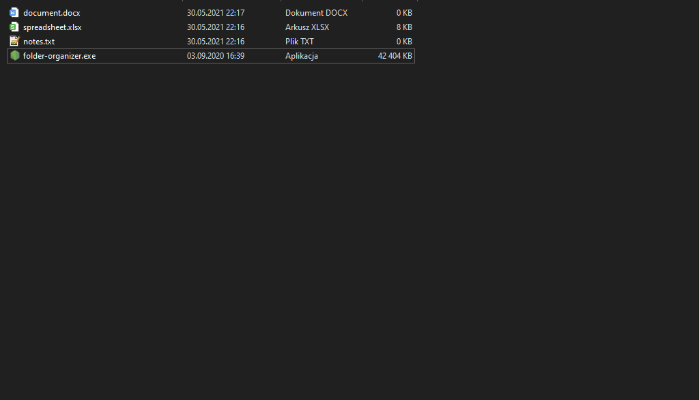

[Polish](README_pl.md) :point_left:

# Folder organiser

Application for organizing system folders by moving files to appropriate folders.


## Screenshots




## How does it work?
  
The user chooses the folder to be cleaned up. The application then finds and moves freestanding files to the correct folders. The files are grouped by extension.
  
Folders take the name of the extension of the transferred files, eg the text file **note.txt** will be moved to a folder named **TXT**. If the folder does not exist in the target path, then it will be created automatically by the program.


## Run Locally

Clone the project

```bash
  git clone https://github.com/lukasz-brzozko/folder-organiser.git
```

Go to the project directory

```bash
  cd folder-organiser
```

Install dependencies

```bash
  npm install
```

Start the application

```bash
  node index.js
```

## Availability

Application tested on a Windows 10 device.


## License

[MIT](https://choosealicense.com/licenses/mit/)