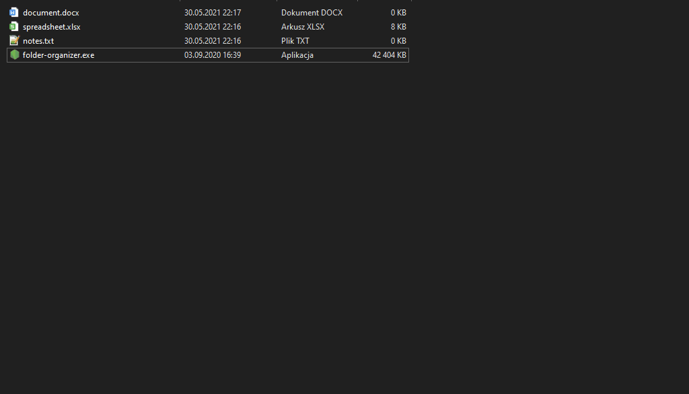

[English](README.md) :point_left:

# Organizator folderu

Aplikacja służąca do organizowania folderów systemowych poprzez przenoszenie plików do odpowiednich folderów.


## Zdjęcia




## Jak to działa
  
Użytkownik wskazuje folder, który ma zostać uporządkowany. Następnie aplikacja znajduje i przenosi "wolne" pliki do odpowiednich folderów. Pliki grupowane są według rozszerzenia. 
  
Foldery przyjmują nazwę rozszerzenia przenoszonych plików, np. plik tekstowy **notatka.txt** zostanie przeniesiony do folderu o nazwie **TXT**. Jeżeli dany folder nie istnieje w docelowej ścieżce, wtedy zostanie on automatycznie utworzony przez program.


## Instalacja

Sklonuj projekt

```bash
  git clone https://github.com/lukasz-brzozko/folder-organiser.git
```

Wejdź do katalogu projektu

```bash
  cd folder-organiser
```

Zainstaluj niezbędne zależności

```bash
  npm install
```

Uruchom aplikację

```bash
  node index.js
```


## Licencja

[MIT](https://choosealicense.com/licenses/mit/)